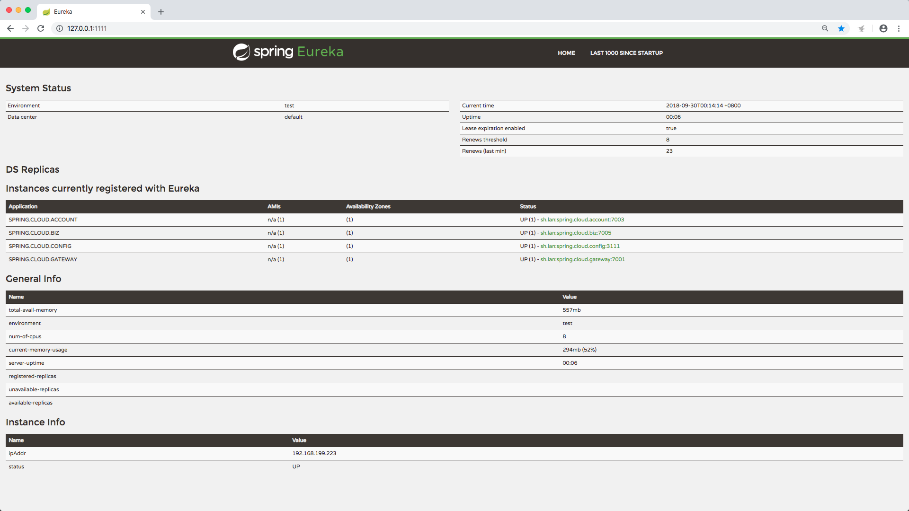

# Introduction

1. This project is a demo project for spring cloud microservice structure which based on <font color=#FF8C00>spring-boot2.x</font>, including but not limited to:
	- spring cloud eureka
	- spring cloud config
	- spring cloud bus
	- ribbon
	- feign
	- hystrix
	- turbine
	- Spring Cloud Starters
	- multi databases with dynamic select（AOP）
	- Global traceId
	- velocity
	- freemarker
	- mybatis, pageHelper (for paging), druid (alibaba druid, for mysql dataSource and connection pool)
	- redis (jdk serialization)
	- rabbitMQ 3.3.7
	- slf4j & logback
	- Internationality
	- Global Exception catch
	- Task executor thread pool
	- HealthCheck, globalHealthCheck

2. ~~This project has a login page. After login, you can see the first page of momentList, add new moments to the list, see the comments of each moment, and add new comments to the comment list.~~

# Run
1. 1st, You should get some components started
	- redis(no username&password and port=6379),
	- rabbitMQ(username=guest, password=guest and port=5672)
	- mysql(username=root, password=123456 and port=3306), the sql for creating databases and tables as below:
	  ```
	  please RUN init.sql 1st
	  ```
2. Java 8 and maven-3 are required.
3. run command in order:
```
bash configure.sh

cd spring-cloud-eureka
mvn clean spring-boot:run

cd spring-cloud-config
mvn clean spring-boot:run

cd spring-cloud-account
mvn clean spring-boot:run

cd spring-cloud-pusher
mvn clean spring-boot:run

cd spring-cloud-biz
mvn clean spring-boot:run

cd spring-cloud-gateway
mvn clean spring-boot:run
```
4. open
```
http://127.0.0.1:7001/account/login?userId=100000&password=123456
http://127.0.0.1:7001/account/detail?userId=100000&password=123456

http://127.0.0.1:7001/a
http://127.0.0.1:7001/b
```
in brower

# spring-cloud-bus is integration with spring-cloud-config, So you can make spring-cloud-config-server broadcast message when configurations updated.
```
curl -v -X POST "http://127.0.0.1:3111/actuator/bus-refresh"
```

# The monitor


# Code explain
1. The dependency of this project is shown below :

2. spring-cloud-parent is just a empty maven project, contains the common poms for other project, so spring-cloud-eureka, spring-cloud-biz, spring-cloud-account and spring-cloud-gateway all inherate from spring-cloud-parent
3. spring-cloud-starter is a demo starter, it cointains the common beans, common bean configurations for spring-cloud-biz, spring-cloud-account and spring-cloud-gateway.
4. spring-cloud-client is a common depency for all, contains some util classes and java Models responding to the db table.
5. spring-cloud-eureka is a server for Service Registration and Service Discovery. The heart beat time of eureka is configed to 5s, instead of 15s.
6. spring-cloud-config is a spring cloud config for dynamic configuration.
7. spring-cloud-account is the account module
8. spring-cloud-pusher is the real business module, contains the moment module and comment module, and this project uses two dbs dynamicly.
9. spring-cloud-biz is the real business module, contains the moment module and comment module, and this project uses two dbs dynamicly.
10. spring-cloud-gateway is the gateway for all these modules. All outer requests from apps or web pages, should be sent to gateway. GateWay should veirify the login status, do the uploading, do some filters or other aspects.
11. If you want to stop any of spring-cloud-account, spring-cloud-biz or spring-cloud-gateway, use this command: ```curl -H 'Accept:application/json' -X POST localhost:7004/shutdown```, to stop the heartbeat to the eureka cluster.

# Deploy to the production env
1. These projects should be deployed like this:


中文介绍： http://www.jianshu.com/p/c14c47243994

Any questions, please send to chxfantasy@gmail.com

HomePage: http://www.jianshu.com/u/c031bded621b

wx: hurry_words
